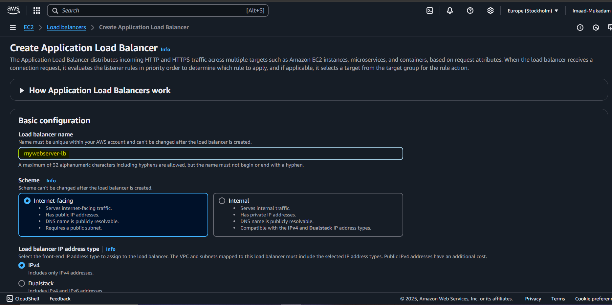
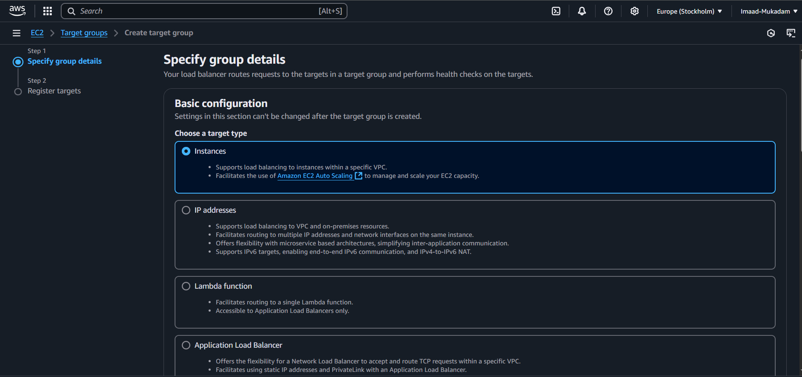

# AWS-Load-Balancer

## Summary

### **AWS Load Balancer Setup Summary with Script**  

1. **Launch 3 EC2 Instances** 🖥️  
   - Ensure they are in the same region.  
   - Install and run a web server using a script.  

2. **Deploy Website Using a Script** 📝  
   - Use the following script during instance creation (under "User Data"):  

   ```bash
   #!/bin/bash
   sudo yum update -y
   sudo yum install -y httpd
   sudo systemctl start httpd
   sudo systemctl enable httpd
   echo "Welcome to $(hostname)" | sudo tee /var/www/html/index.html
   ```

3. **Configure Load Balancer** ⚖️  
   - Create an **Application Load Balancer (ALB)**.  
   - Register all 3 EC2 instances in a **target group**.  
   - Set up a **listener** to forward HTTP traffic.  

4. **Failover Testing** 🔄  
   - Stop one instance and check if the ALB redirects traffic to the remaining instances.  

This setup ensures **high availability** and **automatic traffic distribution**. 🚀

# Step -1 

i. Create 3 Instances


ii. Make sure you allow HTTP as we are going to host a website


iii. In Advanced Details add this script inside user data , this will install web server and host a simple website


iv. Now Lauch your instances , As seen our 3 instances are created!


# Step - 2 

i. Lets configure Load Balancer, In left side there is a load balancer option , click on it


ii. Click on create load balancer then click create application Load Balancer


iii. Provide name of your load Balancer



iv. Select 3 Availibility as this will increase availibilty of your website


# Step - 3 

i. Create a Security group this will allow the inbound and outbound traffic 


ii. Provide name and click on Add rule


iii. Select HTTP and source anywhere as anyone can access this website 


iv. Hit create button and select your security group


# Step - 4

i. Now lets configure target group , we do this to assign where we want redirect the traffic


ii. Choose a target type



iii. Give target group name and next


iv. In this, select your 3 instances where we are going to redirect the tarffic and click on include as pending below


v. Now click on Create target group


vi. Select your target group after creating


vii. after this click on create load balancer

# Step - 5

i. Copy the DNS name , and paste it on your browser


ii. Refresh your website you will see you are redirecting on different instances after every refresh

iii. To confirm check Resource map to check the flow 


